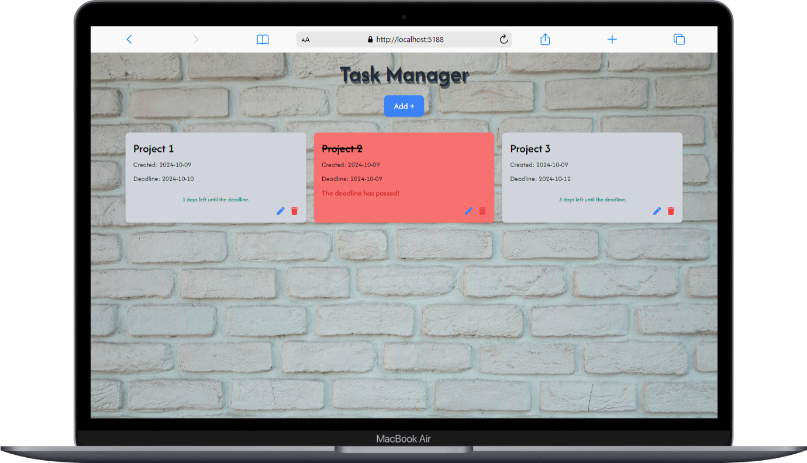

# React + Tailwind Task Board

## Task Manager Project
 This Task Manager project features a modal with a form that opens when the "Add" button is clicked. In this form, you can specify the task's text and set a deadline date. In the notes section, the background color of the notes changes once the deadline passes or on the day of the deadline itself.

 The project also includes inline editing capabilities, allowing you to modify both the text and the deadline directly. Additionally, you can easily delete notes or rearrange them using the drag-and-drop functionality.

 


 ## how to install

# React Vite Project

This project is a React application built with [Vite](https://vitejs.dev/). Vite is a fast build tool that provides a modern development experience and is optimized for performance.

## Prerequisites

Before you begin, ensure you have the following installed on your system:

- [Node.js](https://nodejs.org/) (version 14.18+ recommended)
- npm (comes with Node.js) or [Yarn](https://yarnpkg.com/) as the package manager

## Getting Started

Follow these steps to get the project up and running on your local machine.

### 1. Clone the Repository

```bash
git clone https://github.com/hamedhmd88/Interview-Task
```

### 2. Navigate to the Project Directory
```bash
cd your-repository-name
```

### 3. Install Dependencies
```bash
npm install
or
yarn install
```

### 4. Run the Development Server
```bash
npm run dev
or
yarn dev
```
